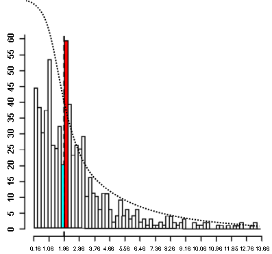

```{r opts,message=FALSE,echo=FALSE,warning=FALSE}
library("knitr")
opts_chunk$set(tidy=FALSE)
```

## More important than statistical philosophy

* Good experimental design (replication, randomization, independence, control, interspersion, adequate power)

> The combination of some data and an aching desire for an answer does not ensure that a reasonable answer can be extracted from a given body of data. [@Tukey1986]

* Sensible, well-posed questions
    * if you want to know if a variable is "important", or what model is "best", you need to know what you mean by that
* Knowledge of the system
* Strong signals will always be detectable; weak signals will never be	
* Better analyses should be (within limits)
    * more powerful
	* better at disentangling (unavoidably) messy data
	* more interpretable
	* more convenient, faster, easier (cf. @ohara_not_2010 vs. @ives_for_2015)
* No free lunches	

## Philosophies 

* don't look for a single philosophy  
[@gigerenzer_surrogate_2015]
* in many cases different philosophies give similar answers;  
differences should be understandable (e.g. @ludwig_uncertainty_1996)

**Frequentist**

* classic, well-tested
* much maligned
* Fisherian (strength of evidence) vs. Neyman-Pearson (decision-theoretic)
* null-hypothesis significance testing
* objective (?)

**Bayesian**

* basic idea:
     * it's easy to compute the probability of the *data* happening given the model (parameters etc.): *likelihood*
	 * if we want to compute the probability of a *model* (parameters), we need to use **Bayes' Rule**
	 * ... this in turn means we need to specify *prior probabilities*  
i.e., what did we think before we saw the data?
     * often bend over backwards to use *weak* or *uninformative* priors
* for strong data, simple cases, get nearly identical answers to freq.
* easier to incorporate prior knowledge [@mccarthy_bayesian_2007]
* easier to incorporate uncertainty [@ludwig_uncertainty_1996]
* easy=easy; medium=hard; hard=possible 
* have to specify priors
* convenience/pragmatic/computational Bayesians: cf. Lele et al
* more natural statement of confidence ...
* **but** ... 'calibrated Bayesianism' (Gelman, de Valpine)
* frequentist approaches [@valpine_better_2003; @solymos_dclone_2010; @ponciano_hierarchical_2009]

## Computational

**permutation testing**

* similar to rank-based non-parametrics  
(Mann-Whitney, Wilcoxon, Spearman correlations ...)  
* robust
* only gives $p$-values (usually)
* e.g. current *phylogenetic overdispersion* methods [@cavender-bares_merging_2009]
* combine with parametric models for robust $p$-values

**information theoretic/algorithmic** [@breiman_statistical_2001]

* interested in prediction 
* large data sets; data mining
* cross-validation etc.
* information-theoretic approaches loosely fall in this category   
(fitting is based on frequentist tools, inference is prediction-based)

## Last thoughts on philosophy

* most of the statisticians I respect are agnostic about philosophies (e.g. Andrew Gelman: 

> ["I have no problem with non-Bayesians: those statisticians who for whatever combination of theoretical or applied reasons prefer not to use Bayesian methods in their own work"](http://andrewgelman.com/2014/03/18/wacky-anti-bayesians/)

* good statisticians choose good tools *and* get good results; makes it harder to tell if the tools or the person is what's powerful (the *methodological attribution problem*, @gelman_bayesian_2010).
* @crome_researching_1997:

> Perhaps the average user of significance tests, without knowing it, smears him- or herself over the three major statistical schools [Fisherian frequentist, Neyman-Pearson frequentist, Bayesian], and disobeys the rules of each ...
	 
## More on practice

* People (including scientists) are lazy (or think they have more
important things to do) and prefer simple rules.
* *Some* rules of thumb for filtering noise are 
helpful ($p=0.05$ is more or less a historical accident
[@dallal_whypvals]: Fisher: ``in fact no scientific worker has a fixed level of
significance at which from year to year, and in all circumstances, he
rejects hypotheses; he rather gives his mind to each particular case
in the light of his evidence and his ideas.''
* Listening to music makes you younger: [@simmons_false-positive_2011]
*  Graphical evidence for $p$-value abuse:

 

[@gerber_publication_2008; @drum_washington_2006]

* Need to decide in advance if you are trying to *confirm (test) hypothesis*, *predict* future outcomes or *explore* the data looking for interesting patterns:  
different rules/procedures in each case!


## References
