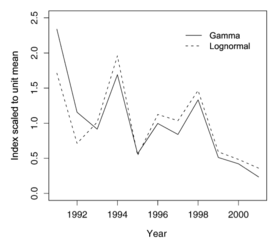

```{r opts,message=FALSE,echo=FALSE}
library("knitr")
opts_chunk$set(fig.width=6,fig.height=4)
```

# Basics/reminders

## Distributions (`family`)

* how to pick distribution?
* use knowledge, not statistical testing -- but cf. @firth_multiplicative_1988, @dick_beyond_2004  
* 99% of GLMs are Gaussian, binomial (usu. Bernoulli), Poisson  
(or overdispersed equivalents)
* log-Normal usually more practical for continuous data than Gamma

## Link functions

* linearizing transformation:  
e.g. $\exp \leftrightarrow \log$, $\textrm{logistic} \leftrightarrow \textrm{logit}$
* *canonical* link usually OK (binomial=logistic, Poisson=log)
* differences (e.g. probit vs logit) mostly have to do with interpretation or culture
* log generally more practical than inverse link for Gamma

## Parameterization

* simple but not easy
* default *treatment* contrasts; *sum-to-zero* contrasts
* interpreting interactions
* R formula (Wilkinson-Rogers) notation
* "what if I want to know the value for each group?":  
fit with `-1` or use `lsmeans`, `effects`, `rockchalk` packages
* centering and scaling [@schielzeth_simple_2010]
* linear models apply **on linear predictor scale**
* rules of thumb for interpreting effects: 
    * log changes $\approx$ proportional
	* logit $\approx$ proportional at ends, $r/4$ near 50%

# Top GLM mistakes

* ignoring overdispersion
* applying discrete models (Poisson, binomial) to non-discrete data: **don't divide!**
* equating negative binomial with binomial rather than Poisson
* confusion in interpreting effects
* worrying about marginal rather than conditional distributions of data
* back-transforming standard errors
* using $(k,N)$ rather than $(k,N-k)$ in binomial models
* getting confused by predictions on the linear predictor scale
* using GLMs where linear models will do (i.e. `glm` instead of `lm`) (*mostly harmless*)
* forgetting to use `type="response"` using `predict.glm()`
* ignoring blocking factors (failing to use mixed models where necessary)

# Relaxing distributional assumptions

## Overdispersion

* *scale parameter* is fixed to 1 for Poisson (variance=mean), binomial (variance=$Np(1-p)$
* often untrue!
* checking: compute `deviance(fit)/df.residual(glm1)`, or use `aods3:gof()`
* across-the-board variance inflation, not outliers/bad model
* more important to do **something** about overdispersion than exactly what you do

**Methods**

* quasi-likelihood (`glm(...,family=quasibinomial)`); point estimates **don't change**, just adjusts std errors/CIs/p-values
* extended/conjugate models (neg binomial [`MASS::glm.nb`], betabinomial); `gamlss`, `bbmle`
* different mean-variance relationships [@hardin_generalized_2007]
    * NB2: $V = \mu + \mu^2/k$ ($k>0$)
    * NB1: $V = \tau \mu$ ($k>1$)
```{r meanvar,echo=FALSE,message=FALSE,fig.width=4,out.width=200,fig.caption=""}
data("Arabidopsis",package="lme4")
library("ggplot2"); theme_set(theme_bw())
library("scales")
library("dplyr")
Arabidopsis %>% group_by(gen,nutrient,amd) %>%
    summarise(mean=mean(total.fruits),var=var(total.fruits)) -> asum
txtdat <- data.frame(mean=c(100,100,100),
                     var=c(250,3500,5500),
                     col=factor(1:3),
                     lab=c("Poisson","NB1","NB2"))
ggplot(asum,
       aes(x=mean,y=var))+geom_point()+
           geom_abline(slope=1,intercept=0,linetype=2)+
               ## geom_smooth(method="loess",colour="blue",fill="blue",span=1.5)+
               geom_smooth(method="lm",formula=y~offset(x)+I(x^2)-1,
                           colour="purple",fill="purple")+
               geom_smooth(method="lm",formula=y~x-1,colour="red",fill="red")+
                   scale_y_continuous(limits=c(0,NA),oob=squish)+
                       labs(x="mean",y="variance")+
                           geom_text(data=txtdat,aes(label=lab,colour=col))+
                scale_colour_manual(breaks=1:3,values=c("black","red","purple"))+
                    theme(legend.position="none")
```
* observation-level random effects in mixed models (lognormal-Poisson; logit-normal-binomial) (`lme4`)
* what about *underdispersion*?
    * less common
	* quasi-likelihood OK
	* ordinal models
	* more exotic (COM-Poisson)

## Zero-alteration

* zero-inflation: **too many** zeros, not just lots of zeros [@warton_many_2005]

```{r echo=FALSE,fig.width=8,message=FALSE}
library("emdbook")
par(mfrow=c(1,3),las=1,bty="l")
set.seed(101)
pp <- function(x,main,...) {
    plot(prop.table(table(x)),ann=FALSE,ylim=c(0,1),
         yaxs="i",...)
    title(main=main)
}
pp(rpois(1000,0.05),main="Poisson(0.05)")
pp(rnbinom(1000,mu=0.1,size=0.01),main="NB(0.1,k=0.01)")
pp(rzinbinom(1000,mu=4,size=5,zprob=0.8),main="ZINB(4,k=5,z=0.8)")
```

* zero-alteration: maybe too few zeros?
* zero-*truncation*: no zeros
    * truncated Poisson/binomial
	* or just assume $X \sim \textrm{Poisson}(\lambda)+1$ (easier)
* *zero-inflation* (mixture of *structural* and *sampling* zeros) and *hurdle* models (spike at zero + *truncated* distribution): `pscl` package
* don't throw out zeros - but remember that a data set with mostly zeros is not very informative!
* zero-inflated *continuous* data?
    * two-stage (binomial + positive distribution)
    * censoring model (Tobit)
    * Tweedie models

## Beta regression

* for proportion data where we *don't* know the denominator
* `betareg`, `bbmle`, `glmmADMB` packages
* exact 0 and 1 values are problematic

# Extend location model

## Polynomials

* adding quadratic term can make a big difference
* link-function polynomials are more reasonable (e.g. quadratic + log-link=Gaussian)
* probably not worth taking too seriously/going beyond cubic

## Additive models

* smooth piecewise cubic functions (partitioned at *knots*) [@wood_generalized_2006]
* simple: `splines::ns(.,df=k)`
* `mgcv`: penalized spline models
* harder to interpret
* slightly more 'expensive' than simpler nonlinear models
* harder to constrain (linear extrapolation)
* extensions: 2-D, monotonic, convex ...

## Link tricks

* use alternate links, or transform $X$ variable
     * log-link, `y~x`: exponential
	 * log-link, `y~log(x)`: power-law \\
($Y=\exp(a+b \log(X)) \to Y=c X^d$
* binomial model with log-link gives exponential (or saturating-exponential) model [@Strong+1999; @Tiwari+2006]
     * `y~x-1, family=binomial(link="log")` $\to Y=\exp(bx)$
* inverse link with `y~1/x` gives *hyperbolic* (Michaelis-Menten/Holling type II) type models
* power-logistic
* defining upper limit for logistic
* use `glm(...,family=gaussian(link="log"))` to fit exponential models with *constant* variance (cf. `lm(log(y)~x)`)

## Nonlinear models

* complete flexibility
* formula interface of `bbmle` simplifies things
* need to pick starting values; worry more about parameterization

# Misc tricks

## Offset tricks

* constants added to the linear predictor
* Poisson model: add $\log(\textrm{area})$ (or whatever) to model a ratio of counts by exposure
   * $Y = \exp(b_0 + b_1 x \boldsymbol{+ \log A}) \to Y/A = \exp(b_0 + b_1 x)$
* survival/mortality model: use $\log(\textrm{exposure})$ on **log-hazard** scale (`binomial(link="cloglog")`), or power-logistic ("Mayfield ratios")
* for convenience in resetting null model. e.g. log-link, `y~log(x)+offset(log(x))` tests difference from isometric model

## Complete separation

* all-zero/all-one categories in binomial, Poisson models
* GLM estimate *should* be infinite (but is just large); maybe `glm.fit` warning
* *bias-reduced* estimate (Firth); `brglm`, `logistf` packages
* standard errors and $p$-values from `summary()` (*Wald* approximation) are crazy
* Bayesian priors: `arm::bayesglm`



## References

