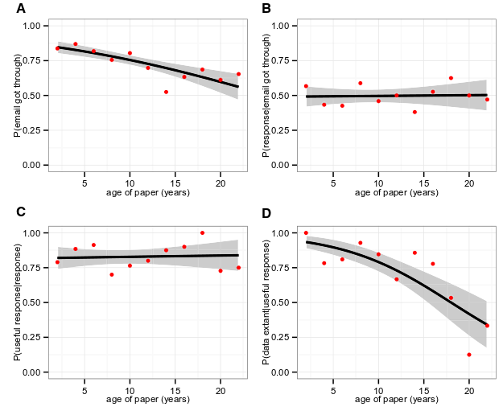
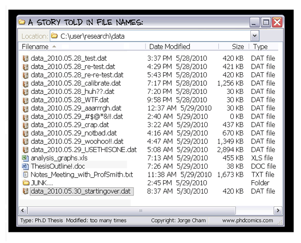

# The big picture

## reproducibility: why now?

* the reproducibility crisis (?)
* growth of meta-science
* more complex analyses
* more collaboration
* more network/storage availability
* dark data and data rot

 [@vines_availability_2014]

## why you?

* ethical obligation/good science
* re-use = visibility
* personal sanity: past-you and future-you
* shiny toys

# your workflow

## metadata

* data describing your data: locations, species names, etc.
* not well supported in R
* conflict between simplicity/portability/convenience and metadata maintenance
* [EML](https://github.com/ropensci/EML) package?
* revision control systems for metadata about *changes*

## workflow tips

* batch vs interactive processing
* DRY (don't repeat yourself) -- functions should be in one place, re-usable/re-used
* organic process:
    * experiments in console window
	* rough code in main script
	* code $\to$ functions in main script
	* functions $\to$ separate file
	* functions $\to$ package
* batch runs

## future-proofing

* package/R version:
    * print `sessionInfo()` at end of output
    * `checkpoint`, `packrat` packages

## data handling

* process is most important, but tools are important too
* host/archive data online/centrally
* private repository while developing, open on publication
* data formats:
     * **AVOID EXCEL**: date-
     * CSV is low-tech but most portable etc.
     * RData (`rda` or `rds`): fast, compact, flexible, but not human-readable or useful outside the R ecosystem (store as intermediate product)
* changes to primary data should be versioned and stored

## directory structure

* your code should not contain any *absolute file paths*
(e.g. `C:\Users\Joe` or `/home/users/joe`)
* other users should be able to mimic your setup exactly
* you can include a commented-out `setwd()` command in the code for your own reference
* use `Set working directory to source file location` in RStudio
* maybe subdirectories for data etc. or sub-projects, if complex

## using the command line

* `Terminal` on MacOS, Start Menu/`cmd` on Windows (Cygwin for more features)
* `R CMD BATCH`
* change directory with `cd` (Unix), `chdir` (Windows)

# Revision control systems

## Revision control


[PhD comics](http://www.phdcomics.com/comics/archive.php?comicid=1323)

* archive materials (code and data) securely
* track changes
* view changes
* roll back changes
* document changes


[xkcd](https://xkcd.com/1296/)

## Revising data

* make only "permanent" changes to data files (recorded on archives)
* temporary changes only within R script
    * recoding
	* subsetting

## Git

* revision control system
* materials accessible both off- and online
* enables collaborative work
* can set up local server ...

## Github and Bitbucket

* free, public storage
* private repositories available on BB, [for students and academics](https://education.github.com/) on GH 
* web front end
* development tools (issue tracker, wiki, etc etc)

## Data repositories

* data publishing, with or without a journal article
* GH/BB much better than nothing, but *not* archival ...
* Git repositories can be copied to other servers  
(you always have a nearly up-to-date version locally)
* Dryad
* [Ecological Archives](http://esapubs.org/archive/)
* [http://oad.simmons.edu/oadwiki/Data_repositories](list of repositories)

## Github via RStudio

* [setting up RStudio to work with GH](http://jennybc.github.io/2014-05-12-ubc/r-setup.html)
* [starting a new GH repo/project](http://jennybc.github.io/2014-05-12-ubc/ubc-r/session2.4_github.html)

# Rmarkdown

## history

* literate programming [@Knuth.LP]
* ancestor of RR
* similar tools, different scope
* software development: code as documentation
* CWEB $\to$ Sweave $\to$ knitr

## Markdown basics

* formatting; italic, bold, bulleted lists, section headings
* math via included LaTeX, e.g. `$\sqrt{x^2 + y^2}$` =
$\sqrt{x^2+y^2}$
* tables
* bibliographic citations

## RMarkdown basics

* embedded, highlighted code chunks: 
 
    `r ''` ```{r mychunk}
	
and end with triple back-quote
		
* figures embedded automatically
* code chunk caching
* inline expressions: `` `r '\x60r foo+bar\x60'` ``

## Rmarkdown: code chunk options

* Set per chunk, e.g. `r ''` ```{r mychunk,echo=TRUE,eval=FALSE}```
or globally via `opts_chunk$set(...)`
    * `eval`: evaluate?
    * `echo`: show code?
    * `warning`/`message`/`error`: show/stop?
    * `results`: `"markup"` is default, I sometimes use `"hide"`
    * `tidy`: reformat code?
    * `cache`: cache results?
* Use caching sparingly; big runs should be separated into a batch file	

## Rmarkdown tips: figures

* figure size adjustment
* graphics formats: bitmap (PNG) vs vector (PDF)
* `useRaster` for big images


## Output formats

* PDF
* HTML
* docx

# Collaboration

* it's just hard
* e-mailing back and forth
* platforms: Dropbox, Google drive/docs, Github/Bitbucket
* markup: Word, google doc, PDF/Acrobat, everything else

# Exercises

* set up an Rmd document:

* Github setup; [student discounts] for private repositories

# Resources

* Software Carpentry
* [ROpenSci](https://ropensci.org)
* Rich Fitzjohn on RR
    * [blog post](https://ropensci.org/blog/2014/06/09/reproducibility/)
    * [github](https://github.com/richfitz/reproducibility-2014)
* notes from Jenny Bryan? e.g. https://stat545-ubc.github.io/automation00_index.html

## References

